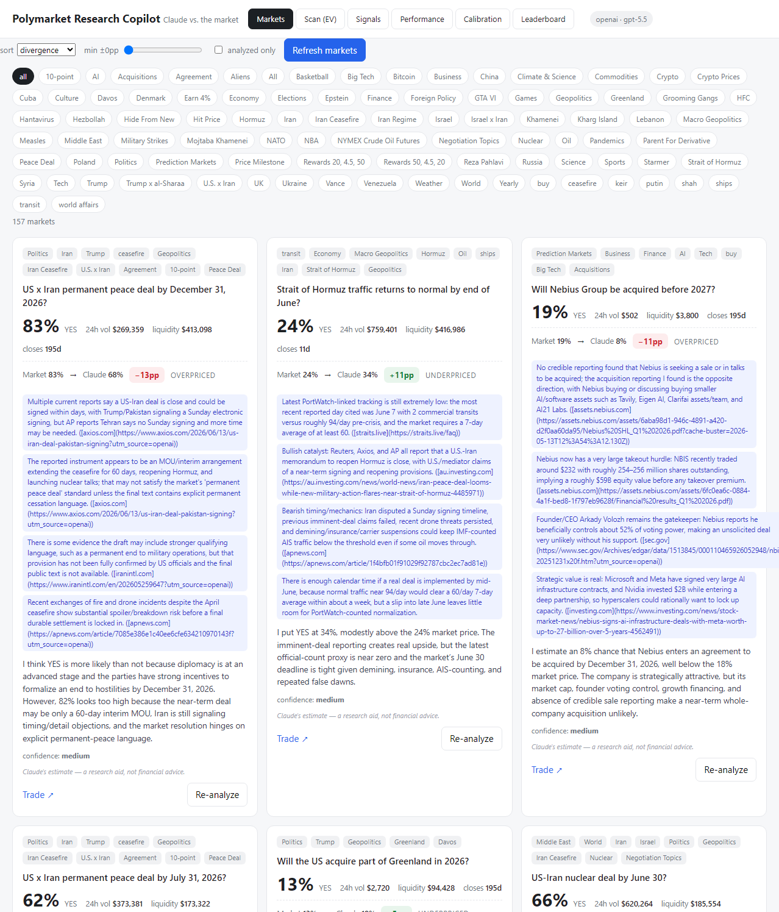

# Polymarket Research Copilot

[](https://github.com/ian-menachery/prediction-market-research-assistant/actions/workflows/ci.yml)

A local research tool that fetches live **Polymarket** and **Kalshi** prediction markets, asks an
LLM (OpenAI or Anthropic, with web search) for a calibrated probability estimate, and surfaces the
markets where the model's estimate diverges most from the current market price.

It's a *research aid* — a structured way to find "where to look," not a trading bot. It is read-only
against the exchanges and never places orders.

> **Disclaimer:** Estimates come from an LLM and are not financial advice. EV figures are directional.

## Demo



<sub>The markets view shows each LLM estimate against the live price with a divergence badge.
The other tabs — **Scan (EV)** (markets ranked by annualized EV off the executable order-book
price), **Leaderboard** (per-model Brier / log-loss / Brier skill), and **Performance**
(equity-curve track record) — fill in as you run scans and analyzed markets resolve. See
[`docs/img/`](docs/img/) for how to capture them.</sub>

## What it does

- **Dual exchange** — normalizes Polymarket (Gamma API) and Kalshi markets into one model; scan
  either or both (`EXCHANGE=polymarket|kalshi|both`).
- **Dual LLM provider** — `LLM_PROVIDER=openai|anthropic`, switchable via `.env`. Each analysis
  records the model that produced it, so calibration stays per-model across a provider switch.
- **EV divergence scanner** — ranks markets by annualized expected value using the model's
  *calibrated* estimate vs. the **executable** order-book price (depth-aware VWAP fill), not just the
  mid. Falls back to the mid when no two-sided book is available.
- **Adversarial refutation** — a skeptical second pass (optionally cross-model) re-checks the
  top-ranked edges before they're trusted.
- **Calibration tracking** — temperature-scaling recalibration per model, reliability curves,
  Brier/log-loss, and a CSV export (with forecast horizon) for the companion calibration tracker.
- **Model leaderboard** — an apples-to-apples LLM eval: each model scored on *its own* resolved
  forecasts (Brier, log-loss, directional accuracy, and Brier skill vs. the base-rate baseline).
- **Forward signals & track record** — logs actionable edges at scan time, scores realized P&L
  once the market resolves, and rolls them into an equity curve with return-on-cost, per-trade
  Sharpe, max drawdown, and win rate (the real calibration flywheel — lookahead-free).
- **Background automation** — stdlib scheduler (no APScheduler) for periodic scans, resolution
  sweeps, and optional stale re-analysis; high-divergence alerts to a JSONL log + optional webhook.
- **No-build web UI** — Flask serves a React (CDN) frontend at `/` — an `index.html` shell plus
  `frontend/js/` split by area, transformed in-browser (no bundler): markets, scanner, signals,
  performance, calibration, and leaderboard views.

## Technical highlights

A few of the more interesting engineering decisions:

- **Runtime-swappable dual-LLM abstraction** — one analysis engine targets both the OpenAI
  Responses API and the Anthropic Messages API (each with server-side web search). The provider is
  an env var, not a code path; every estimate records the model that produced it so calibration
  stays valid across a switch. Quota exhaustion latches an explicit error rather than silently
  failing over.
- **Calibration as temperature scaling** — `p_cal = σ(logit(p) / T)`, with `T` fit by ternary
  search to minimize log-loss over resolved markets, plus reliability binning and a Brier-skill
  leaderboard. Pure stdlib, fully unit-tested.
- **Executable, depth-aware pricing** — EV is computed against a volume-weighted fill walked over
  the live order book for a target position size, not the top-of-book mid, so thin books yield a
  truer (worse) cost.
- **Cross-model adversarial refutation** — top edges get a skeptical second pass that can run on
  the *opposite* provider, derived deterministically rather than self-reported.
- **Concurrency without async** — a threaded Flask server and a stdlib background scheduler share
  one SQLite file safely via WAL + a busy timeout (no asyncio, no Postgres).
- **Enforced module boundaries** — HTTP lives only in the exchange clients, SQL only in `db.py`,
  LLM calls only in `analyzer.py`; routes stay thin. ~3K LOC, type-hinted throughout and
  mypy-clean, gated by CI on every push (see [Quality & CI](#quality--ci)).

## Stack

Python 3.12 · Flask · httpx (sync) · Pydantic · SQLite (stdlib) · OpenAI / Anthropic SDKs.
No asyncio, no build pipeline, no Docker — it's a deliberately small local tool.

## Quick start

```bash
make install
cp .env.example .env      # set LLM_PROVIDER + the matching API key
make run                  # → http://localhost:5000
```

## Make targets

| Target | What it does |
| --- | --- |
| `make install` / `make install-dev` | runtime deps / dev deps (pytest+cov, ruff, mypy, pre-commit, pip-audit, selenium, pip-tools) |
| `make run` | start the Flask app on :5000 |
| `make test` / `make cov` | run the suite (140+ tests) / same with coverage + the fail-under floor |
| `make lint` / `make typecheck` | ruff / mypy over `src` (+ `tests` for ruff) |
| `make lock` | regenerate pinned `requirements*.lock` |

## Quality & CI

Every push and PR runs GitHub Actions ([`.github/workflows/ci.yml`](.github/workflows/ci.yml)):

- **ruff** — lint (`make lint`).
- **mypy** — static type checking; the code is fully type-hinted and mypy-clean (`make typecheck`).
- **pytest + coverage** — 140+ tests with a **55% coverage floor** that fails the build if it drops
  (`make cov`; config in `pyproject.toml`).
- **pip-audit** — dependency CVE scan (advisory).

Backed by:

- **Frontend smoke test** — loads the UI in headless Chrome and asserts React actually mounts
  (skips cleanly when no browser is present), with a companion test that keeps the React/Babel CDN
  `<script>` tags version-pinned — together they guard against blank-page regressions.
- **Dependabot** ([`.github/dependabot.yml`](.github/dependabot.yml)) — weekly grouped
  dependency-update PRs (pip + Actions), each gated by the checks above.
- **pre-commit** ([`.pre-commit-config.yaml`](.pre-commit-config.yaml)) — runs ruff + mypy before
  each commit; enable once with `pre-commit install`.

## Project layout

```
src/research/      models · db · polymarket · kalshi · exchanges · analyzer · scanner · calibration · performance · scheduler · app
frontend/          no-build React UI — index.html shell + js/ split by area
scripts/           portfolio sim + crowd-calibration backtest (CLI)
tests/             pure-logic, DB round-trip, route, resilience + frontend smoke / pinned-CDN tests
```

Deeper docs: [`ARCHITECTURE.md`](ARCHITECTURE.md) (data flow + schema),
[`ROADMAP.md`](ROADMAP.md) (phased plan), [`API_REFERENCE.md`](API_REFERENCE.md) (Polymarket /
Kalshi / LLM APIs), [`CALIBRATION_NOTES.md`](CALIBRATION_NOTES.md).

## Configuration

All runtime knobs are environment variables (see [`.env.example`](.env.example) for the full set):
provider/model, exchange selection, volume/liquidity/divergence gates, target position size,
scan & resolution & stale-reanalysis cadences, and alert thresholds/webhook. API keys are read from
the environment only and never committed (`.env` is gitignored).

## License

[MIT](LICENSE) © Ian Menachery
