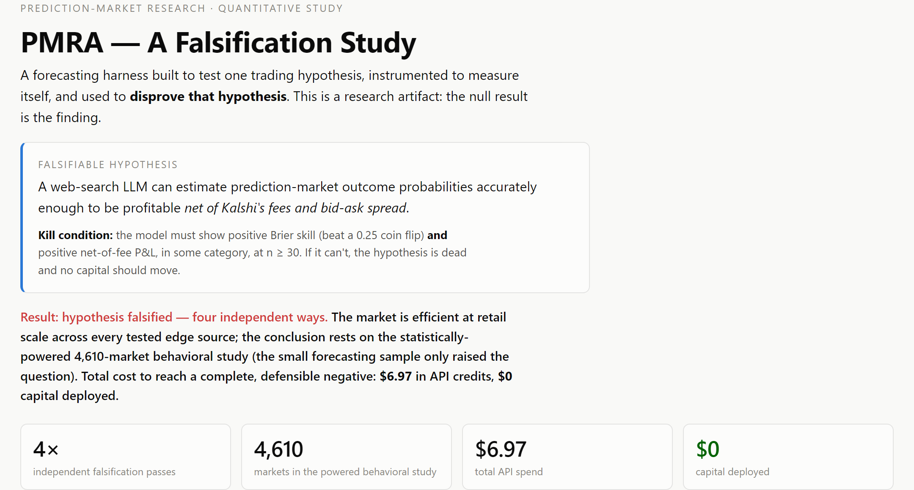
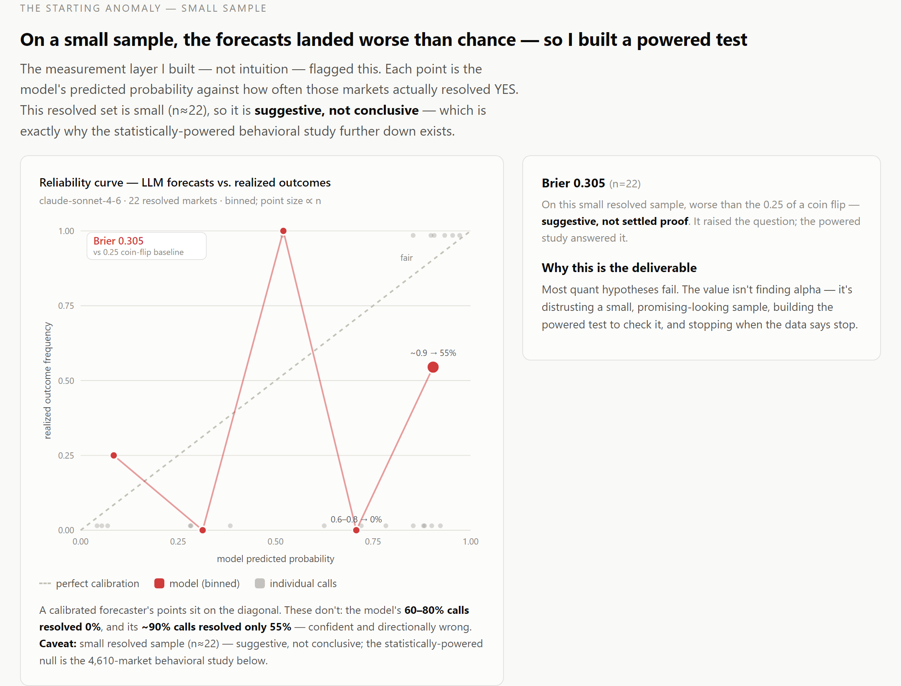
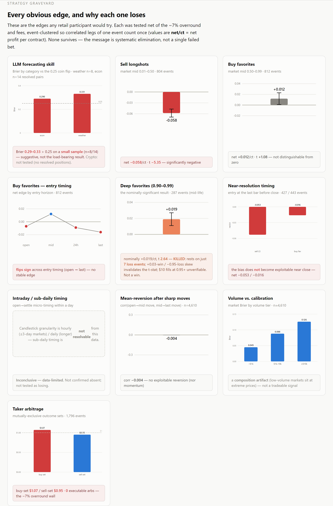

# PMRA — Prediction-Market Research Assistant

[](https://github.com/ian-menachery/prediction-market-research-assistant/actions/workflows/ci.yml)

> ▶ **Live dashboard:** https://ian-menachery.github.io/prediction-market-research-assistant/ — the interactive study, no clone or run needed (served from `index.html` via GitHub Pages).

**A falsification study.** PMRA tested one trading hypothesis, built the instrumentation to measure it
honestly, and used that instrumentation to **disprove it**. The null result is the finding.

> **Hypothesis (falsifiable):** a web-search LLM can estimate prediction-market (Kalshi) outcome
> probabilities accurately enough to be profitable *net of fees and the bid-ask spread*.
>
> **Kill condition:** show positive Brier skill (beat a 0.25 coin flip) **and** positive net-of-fee
> P&L, in some category, at n ≥ 30. If it can't, the hypothesis is dead and no capital should move.

**Result: falsified — four independent ways. $6.97 total API spend, $0 capital deployed, complete
negative conclusion.** The market is efficient at retail scale across every edge source tested.

### The evidence hierarchy (read this first)

The passes are **not co-equal.** The conclusion rests on the **statistically-powered** result — a
**4,610-market / 1,901-event behavioral study** with event-clustered standard errors and net-of-overround
EV per contract. The early **forecasting** results (13 settled predictions ≈ 5 independent events;
22 resolved analyses; Brier 0.305) are a **small, under-powered sample** — suggestive, not conclusive.
Recognizing that n=13 across a handful of correlated events was too small to conclude anything is
*precisely why the powered study exists*. The small sample raised the question; the large study answered
it.

### Start here

- **[`index.html`](index.html)** — the visual study (self-contained; open by double-click, or view it
  [live](https://ian-menachery.github.io/prediction-market-research-assistant/)). Hero calibration curve,
  the four falsification passes, a "strategy graveyard" of every obvious edge, and two judgment call-outs
  (a look-ahead leak caught; a nominally-significant result killed).
- **[`PORTFOLIO_PMRA.md`](PORTFOLIO_PMRA.md)** — the narrative writeup.
- **[`BACKTEST_NOTES.md`](BACKTEST_NOTES.md)** + **[`backtest/`](backtest/)** — the reproducible data and
  analysis scripts behind every chart (e.g. `python backtest/behavioral/analyze.py` regenerates the
  behavioral-study numbers offline).

## The study at a glance



*The hypothesis, its explicit kill condition, and the headline result — the conclusion rests on the statistically-powered 4,610-market study, not the small forecasting sample.*



*Calibration curve: on the small resolved sample (n≈22) the model's forecasts landed worse than a coin flip — the anomaly that **motivated** a properly-powered test, not the basis for the conclusion.*



*Strategy graveyard: every obvious edge a retail participant would try, each tested net of the ~7% overround (the exchange's built-in margin) — a wall of systematic elimination, not a single failed bet.*

> **Disclaimer:** estimates came from an LLM and are not financial advice; the tool is read-only against
> the exchanges and never places orders. It is a research harness, not a product.

## What was found

- **Forecasting skill — *suggestive, under-powered*.** On the small resolved sample the model's
  forecasts landed worse than a coin flip (Brier 0.305, n=22; econ 0/8, weather 1/5). Too small to
  conclude on its own — this is what motivated the powered test below.
- **Structural / taker arbitrage — dead.** Across 1,796 mutually-exclusive events, buying the full
  outcome set costs ~$1.07 for a $1 payout (~7% overround); zero executable arbitrages.
- **Behavioral / mechanical edge — *the load-bearing null*.** 4,610 resolved markets, event-clustered.
  The favorite-longshot bias is real *gross* but fully consumed by the overround net of fees: selling
  longshots is significantly negative (−0.058/contract, t = −5.35); buying favorites is indistinguishable
  from zero (+0.012, t = 1.08). A real signal, zero net edge.
- **Judgment, not just results.** A look-ahead leak that would have manufactured a fake positive was
  detected (6/6) and discarded; a deep-favorite result that cleared t ≈ 2.6 was killed after recognizing
  its extreme payoff skew made the statistic invalid on an under-sampled loss tail.

## The harness — the hypothesis under test

The Flask app is the **original research harness**: the naive "LLM finds mispriced markets" pipeline that
the powered backtesting later evaluated and found to have no edge. It is read-only and, by default, does
not spend (`SCAN_INTERVAL_HOURS` is empty). Engineering notes, kept because the rigor is the point:

- **Runtime-swappable dual-LLM abstraction** — one analysis engine targets both the OpenAI Responses API
  and the Anthropic Messages API (each with server-side web search); the provider is an env var, and
  every estimate records the model that produced it so calibration stays per-model. Quota exhaustion
  latches an explicit error rather than silently failing over.
- **Calibration as diagnostic instrumentation** — temperature scaling `p_cal = σ(logit(p) / T)`, `T` fit
  by ternary search to minimize log-loss, plus reliability binning and a Brier-skill leaderboard. Built
  to *measure* the model, not to rescue it (it never reached its 50-pair activation threshold, and
  temperature scaling can't fix a directional skill failure anyway).
- **Executable, depth-aware pricing** — EV is walked over the live order book as a realistic far-touch
  VWAP fill for a target size, not the top-of-book mid, so thin books yield a truer (worse) cost.
- **Append-only prediction↔outcome tracking** — every prediction is stored and later joined to the
  realized outcome, so calibration/Brier and the ROI track record are *measured, not asserted*. This
  store is the reusable asset.
- **Concurrency without async** — a threaded Flask server and a stdlib scheduler share one SQLite file
  via WAL + busy timeout (no asyncio, no Postgres).
- **Enforced module boundaries** — HTTP only in the exchange clients, SQL only in `db.py`, LLM calls only
  in `analyzer.py`; routes stay thin. ~4,600 LOC, type-hinted throughout and mypy-clean, gated by CI.

## Stack

Python 3.12 · Flask · httpx (sync) · Pydantic · SQLite (stdlib) · OpenAI / Anthropic SDKs.
No asyncio, no build pipeline, no Docker — a deliberately small local tool. Kalshi-only for trading
context (US-based; Polymarket blocks US users and is a read-only signal source at most).

## Running the harness

```bash
make install
cp .env.example .env      # set LLM_PROVIDER=anthropic + ANTHROPIC_API_KEY; EXCHANGE=kalshi
make run                  # → http://localhost:5000
```

The UI opens on the Markets view; the **Model predictions** tab shows the initial, under-powered
predictions and how they resolved (historical evidence, not recommendations). Spending stays off until
`SCAN_INTERVAL_HOURS` is set — reads and resolution sweeps are free.

## Make targets

| Target | What it does |
| --- | --- |
| `make install` / `make install-dev` | runtime deps / dev deps (pytest+cov, ruff, mypy, pre-commit, pip-audit, selenium, pip-tools) |
| `make run` | start the Flask app on :5000 |
| `make test` / `make cov` | run the suite / same with coverage + the fail-under floor |
| `make lint` / `make typecheck` | ruff / mypy over `src` (+ `tests` for ruff) |
| `make lock` | regenerate pinned `requirements*.lock` |

## Quality & CI

Every push and PR runs GitHub Actions ([`.github/workflows/ci.yml`](.github/workflows/ci.yml)): **ruff**
(lint), **mypy** (fully type-hinted, mypy-clean), **pytest + coverage** (with a coverage floor that fails
the build if it drops), and **pip-audit** (advisory CVE scan). Backed by a headless-Chrome frontend smoke
test (asserts React actually mounts; skips cleanly with no browser) plus a companion test that keeps the
React/Babel CDN tags version-pinned, **Dependabot**, and **pre-commit** (ruff + mypy).

## Project layout

```
index.html          self-contained visual falsification study (GitHub Pages entry; open by double-click)
PORTFOLIO_PMRA.md   narrative writeup
BACKTEST_NOTES.md   the four passes + Politics gate, with numbers
backtest/           reproducible backtest data + analysis scripts (behavioral study, look-ahead probe)
src/research/       models · db · polymarket · kalshi · exchanges · analyzer · scanner · calibration · performance · scheduler · app
frontend/           no-build React UI — index.html shell + js/ split by area (the original harness UI)
tests/              pure-logic, DB round-trip, route, resilience + frontend smoke / pinned-CDN tests
```

Older build docs ([`ARCHITECTURE.md`](ARCHITECTURE.md), [`ROADMAP.md`](ROADMAP.md),
[`API_REFERENCE.md`](API_REFERENCE.md), [`CALIBRATION_NOTES.md`](CALIBRATION_NOTES.md)) predate the
falsification framing and carry a note to that effect at the top.

## Configuration

All runtime knobs are environment variables (see [`.env.example`](.env.example)): provider/model,
exchange selection, volume/liquidity/divergence gates, target position size, scan & resolution &
stale-reanalysis cadences, alert thresholds/webhook. API keys are read from the environment only and
never committed (`.env` is gitignored).

## License

[MIT](LICENSE) © Ian Menachery
